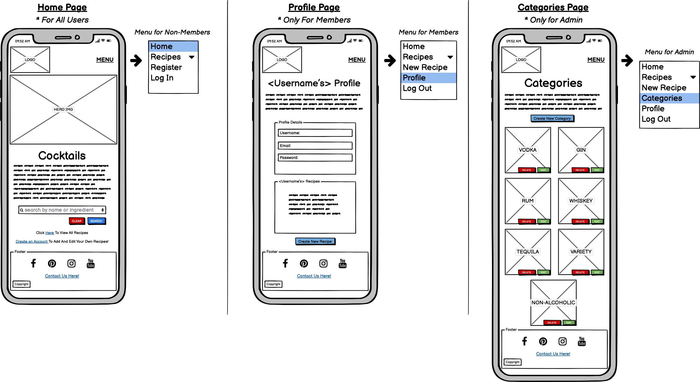
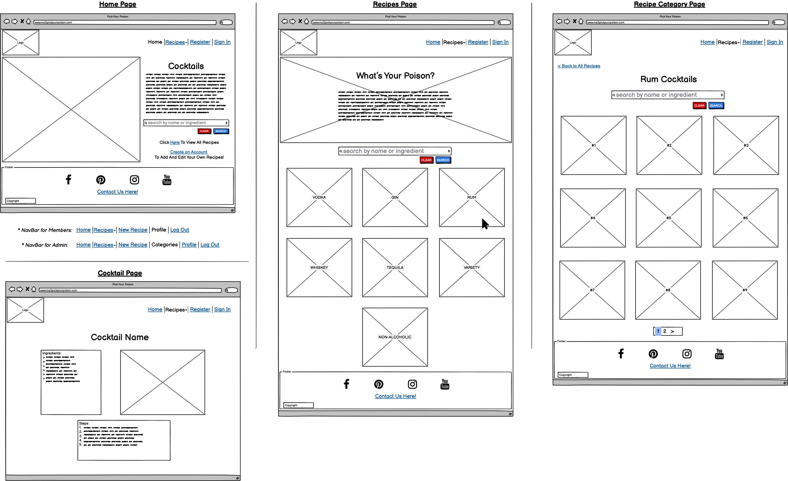
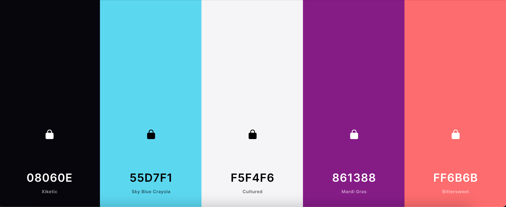

# 
**MS3: Pick Your Poison**

 ### View the live project [here.](https://ms3-pickyourpoison.herokuapp.com/)

This website has been created as my submission for Milestone Project 3 for the Code Institute. *Pick Your Poison* is a collaborative cocktail recipe site designed to allow users to search for and discover new cocktails as well as sharing their own recipes. Users can create an account which allows them to upload and edit their own cocktails. Non-members can also search for and browse the cocktail recipes. The site is designed to be user-friendly and visually appealing while also being responsive across a range of devices.

---

## Contents
- [**User Experience (UX)**](#ux)
    - [Strategy](#strategy)
        - [Target Audience](#target-audience)
        - [User Stories](#user-stories)
        - [Site Owner Goals](#site-owner-goals)
    - [Scope](#scope)
    - [Structure](#structure)
    - [Skeleton](#skeleton)
    - [Surface](#surface)
        - [Design](#design)
        - [Colours](#colours)
        - [Fonts and Icons](#fonts-and-icons)
        - [Final Design Changes](#final-design-changes)
 - [**Features**](#features)
 - [**Technologies Used**](#technologies-used)
    - [Languages](#languages)
    - [Technologies](#technologies)
 - [**Testing**](#testing)
 - [**Deployment**](#deployment)
    - [Creating the Project](#creating-the-project)
    - [Deploying to Heroku](#deploying-to-heroku)
    - [Deploying Locally](#deploying-locally)
 - [**Credits**](#credits)
    - [Content](#content)
    - [Code](#code)
    - [Acknowledgements](#acknowledgements)

---
## 
**UX**

### **Strategy**
#### Target Audience
The target audience for this site would be adults who have a keen interest in mixology, from beginners looking to learn how to make their first cocktail, to professionals on the search for new and exciting recipes.

#### User Stories
All Users
- As a user, I want to easily navigate through the site.
- As a user, I want the site to be responsive on whichever device and/or browser I'm viewing it on.
- As a user, I want to easily contact the site owners with any questions I might have or problems I may encounter.
- As a user, I want to search for and browse different cocktail recipes.

First-Time User/Non Member
- As a first-time user, I want to immediately understand the purpose of the site.
- As a first-time user, I want to easily create an account if I choose to do so. 

Registered Users
- As a registered user, I want to easily log in with my username and password.
- As a registered user, I want to easily create my own cocktail recipes.
- As a registered user, I want to easily edit or delete my own cocktail recipes.
- As a registered user, I want to easily view my profile
- As a registered user, I want to easily log out from my account.
- As a registered user, I want visual confirmation of any task performed.

Admin User
- As the admin, I want to be the only user who can add or edit cocktail categories.

#### Site Owner Goals
- Create a site that is appealing and useful to encourage users to create an account and upload new cocktail recipes.
- Build up a large database of cocktail recipes via new users.

### **Scope**
For all Users: 
- The site must be fully responsive across different devices and browsers.
- The site must be visually appealing and consistent to ensure the user is comfortable.
- A *fixed navigation bar* must be included to allow users to easily navigate throughout the site.
- A clear way of contacting the site owners must be provided via a *contact form*.
- A clear and simple means of searching for and browsing cocktail recipes must be provided via a *search bar*.

For First-Time Users/Non-Members: 
- Clear information about the purpose of the site must be provided.
- A clear and simple means of creating an account must be provided.

For Registered Users:
- Clear and simple means of:
    - logging into their account,
    - creating a new cocktail recipe, 
    - editing or deleting their recipes, 
    - viewing their profile, 
    - and logging out of their account must be provided.
- Visual confirmation of tasks performed must be provided.

For Admin:
- A clear and simple means of adding and/or editing cocktail recipe categories.

### **Structure**
The structure of the site varies slightly depending on who the user is. All users will see the same fixed navigation bar, with some differing page options, and footer across the site. The colour and design is also consistent across all pages of the site.

#### Navigation Bar
- For All Users:
    - Will contain clear names of each site page for navigation ease; Home, Recipes (which is a dropdown item with links to the different cocktail categories), Register and Log In.
    - Will contain the site logo which acts as a link to the *Home* page.
    - Will remain consistent throughout the site.
    - Will turn into a collapsible menu on smaller devices for a cleaner design.

- For Registered Users (when logged in):
    - Will contain clear names of each site page for navigation ease; Home, Recipes (which is a dropdown item with links to the different cocktail categories), New Recipe, Profile and Log Out.

- For Admin (when logged in):
    - Will contain clear names of each site page for navigation ease; Home, Recipes (which is a dropdown item with links to the different cocktail categories), New Recipe, Categories, Profile and Log Out.

#### Footer
- Will remain consistent throughout the site.
- Will contain links to various social media platforms.
    - As the site owner does not yet have social media accounts, these links will bring the user to the main social media platform rather than to a particular account.
- Will contain a link which brings the user to a contact form if they wish to contact the site owner ("Contact Us Here!").

#### Home Page
- This page will be the same for all users, content-wise, whether they are a member or not.
- A quick introduction to the site will be provided.
- A *search bar* will be available, allowing users to search for a particular cocktail or ingredient, including a *button* to clear their search and another to perform the search.
- A link to all cocktail recipes will be clearly displayed.
- A link inviting first-time users/non-members to create an account will be clearly displayed, which also tells them what extra features they can use by being a member (*"Create an Account to add and edit your own recipes"*).

#### Recipes Page
- A *search bar* will be available, allowing users to search for a particular cocktail or ingredient, including a *button* to clear their search and another to perform the search.
- Will contain card panels of each cocktail category (*Vodka, Gin, Rum, Whiskey, Tequila, Variety* and *Non-Alcoholic*).
- Upon clicking a particular card panel, *Rum* for example, the user will be brought to all cocktails in the *Rum* category.
    - A *search bar* will be available, allowing users to search for a particular cocktail or ingredient, including a *button* to clear their search and another to perform the search.
    - A link will be clearly available allowing the user to return to all categories.
    - Each cocktail recipe will be available as a clickable card panel with its name and image clearly seen. 
    - Any cocktail recipe uploaded by the logged in user will have *buttons* to *Edit* and/or *Delete* the recipe.

#### Register Page
- Will contain a form to be filled out to register with fields for *Username*, *Email*, *Password* and a *Submit* button.
- Will contain a link to the *Log In* page for users who are already registered ("Already Registered? Log In Here").

#### Log In Page
- Will contain a form to be filled out to log in with fields for *Username*, *Password* and a *Submit* button.
- Will contain a link to the *Register* page for users who have not yet made an account ("Don't Have An Account? Register Here").

#### Profile Page
- Will only be available to Registered Users.
- Will display the user's Name and Username.
- Will display their own uploaded cocktail recipes.

#### New Recipe Page
- Will only be available to Registered Users.
- Will contain a form to be filled out to complete the cocktail recipe with fields for *Name*, *Choose Main Alcohol* (dropdown selector), *Ingredients, Steps*, *Image URL* and a *Submit* button.

#### Categories Page
- Will only be available to Admin.
- Will display all current cocktail recipe categories.
- Will contain buttons for *Edit* and *Delete* of each category.
- Will contain a button to *Add New Category*.

#### New Category Page
- Will only be available to Admin.
- Will contain a form to be filled out to add the new category with fields for *Category Name*, *Image URL* and a *Submit* button.

#### Contact Page
- Will be accessible via a link in the footer across all site pages.
- Will contain a contact form for the user to fill out with fields for *Name*, *Email Address*, *Your Message* and a *Submit* button.
- Once the form is submitted, the user will receive an automated reply to the email address that they entered to confirm their message has been received.
- Will contain links to various social media platforms.
    - As the site owner does not yet have social media accounts, these links will bring the user to the main social media platform rather than to a particular account.

### **Skeleton**
All wireframes were created using [Balsamiq](https://balsamiq.com/).

#### Mobile

#### Tablet

#### Desktop

All wireframes can be found below;
- [Mobile Wireframes](documentation/wireframes/mobile)
- [Tablet Wireframes](documentation/wireframes/tablet)
- [Desktop Wireframes](documentation/wireframes/dekstop)

### **Surface**
#### Design
The overall design of the site is quite simple while also being visually appealing. I wanted all elements and features to be laid out in such a way that everything is very clear for the user. As the purpose of the site is for users to browse recipes and/or add their own, it was important that users were able to perform these tasks easily without design flaws creating unnessary work for them.

#### Colour
I wanted to choose a darker colour scheme for some main elements of the site, primarily the navigation bar and footer, as I knew that the images of cocktails uploaded would all be extremely bright and colourful. I didn't want the user to experience visual overload by having a huge array of bright and distracting colours wherever they went on the site.  

I used [Coolors](https://coolors.co/) to help me choose colours that worked well together. The brighter colours are used throughout the site for headings and buttons, enough to bring nice pops of colour without being too overwhelming.

- 080603 Xiketic
- 55D7F1 Sky Blue Crayola
- F5F4F6 Cultured
- 861388 Mardi Gras
- FF6B6B Bittersweet

#### Fonts and Icons
I chose Google's Montserrat as the primary font for the site as it has a very clear and modern appearance. Initially I was going to use another Google font, Dancing Script for the headings, to match the logo font, but I found that it affected the headings' legibility so I stuck with Montserrat.  

All icons used on the site are from Font Awesome. They are used to show users which social media platform they can expect to be brought to in the footer. They are also used on the Login, Register and Contact Forms to emphasise the input fields. Icons are also used on each Cocktail Recipe page, one to emphasise the image source text under the image, and the other is used for the recipe steps rather than having regular bullet point.

#### Final Design Changes
Throughout the development process I changed some elements of design as I found that they either weren't practical, or they appeared better on paper (i.e. wireframes) than on a live site.  

The main change was on the *Recipes* page. Initially I planned on that page being a dropdown menu in the navbar which would allow the user to select their cocktail based on its type/category. I decided, however, that this would be a feature best **left for a future release** when there would be a much larger selection of recipes. While the site is only starting to collect recipes I thought that it was creating an unnessary complication for users, i.e. there didn't seem much point in users having to click into a card panel of *Whiskey* cocktails if there's currently only one recipe in that category. As it is, it is still easy for users to browse the recipes and the search bar makes it possible for them to narrow down their search.  

Other differences merely involved slight layout changes of various pages on different screen sizes allowing for a more improved design.

---
## 
**Features**

All features on the site have been put in place to make the user's experience as smooth and simple as possible. As mentioned earlier, it is designed to allow users to complete whatever task they have come to the site to do in an efficient way. It is visually consistent and responsive to keep the user comfortable. The same navigation bar and footer are present on all pages of the site to ensure navigation ease and consistency.

#### Home Page
- The landing page contains a hero image to set the overall tone of site.
- It also contains a quick introduction to the site and its purpose so that a user knows straight away if they're in the right place.
- A *search bar* is present allowing users to immediately search for a particular cocktail, category or ingredient.
- A link to *All Recipes* is provided.
- A link to *Create an Account* is provided only for users who are not currently logged in.

#### Recipes Page
- A *search bar* is present allowing users to immediately search for a particular cocktail, category or ingredient.
- All cocktail recipes appear on this page in the form of equal-sized card panels.
- Each panel displays the cocktail's name, photo and what kind of cocktial it is.
- Each panel has a clickable *View Recipe button* which, when clicked, will bring the user to that cocktails's own page. 
- If the current user is the creator of any of the cocktails, clickable icons for *Editing* and *Deleting* that cocktail will be visible beside the cocktail name in the card panel.  

#### Cocktail Recipe Page
- Each cocktail has its own recipe page displaying;
    - Cocktail Name (cocktail_name)
    - Type of Cocktail (category_name)
    - Who Created the Recipe (created_by)
    - Cocktail Picture (cocktail_image)
    - Picture Credit (image_credit)
    - Ingredients (cocktail_ingredients)
    - Steps (cocktail_steps)
- A link returning back to *All Recipes* is provided.
- If the current user is the creator of any of the cocktails, clickable icons for *Editing* and *Deleting* that cocktail will be visible beside the cocktail name.  

#### New Recipe Page
- This page is only accessible to logged in users.
- A form with fields for *Cocktail Name, Choose Main Alcohol* (dropdown select menu), *Ingredients, Steps, Cocktail Image URL, Cocktail Image Credit* and two buttons, *Cancel* and *Add Recipe* is provided.
- Small labels beneath *Ingredients* and *Steps* explain to the user how to enter the fields.
- Each field is required and upon clicking *Add Recipe*,the user will be alerted if any field is left empty or is filled out incorrectly.
- The *Cancel* button returns the user to the main *Recipes* page.
- The *Add Recipe* button will successfully add a cocktail recipe and return the user to the *Recipes* page with an alert confirming the addition of the new cocktail.
    - The new cocktail can now be seen as its own card panel.

#### Edit and Delete Cocktail Recipe
- These options are only available to the creator of the recipe.
- The *Edit* icon brings the user to the *Edit Cocktail Recipe* page;
    - This page has a form which is pre-filled with all the current values of the recipe and two buttons, *Cancel* and *Edit Recipe*.
    - The *Cancel* button will return the user to the *Recipes* page.
    - The *Edit Recipe* button will successfully edit the recipe and return the user to the *Recipes* page with an alert confirming the edit of the recipe.
- The *Delete* icon triggers a **modal** to appear;
    - This modal asks the user if they are sure they wish to delete this recipe as it cannot be undone.
    - It has two buttons, *Cancel* and *Delete*.
    - The *Cancel* button will close the modal.
    - The *Delete* button successfully deletes the recipe and will return the user to the *Recipes* page with an alert confirming the deletion.
    - The **modal** acts as a defensive feature to ensure the user cannot accidentally delete their recipes.

#### Register Page
- This page is only accessible to users not currently logged in.
- A form with fields for *Username*, *Password* and a *Register button* is provided.
- Small labels beneath each field tells the user what kind of characters are accepted.
- Users will be alerted if either field is empty, filled out incorrectly or if their username has already been taken.
- A link to the *Log In* page is provided if the user already has an account.
- Upon clicking the *Register button* (provided fields are successfully filled out), the user will be brought to their new profile with an alert to confirm their registration.

#### Login Page
- This page is only accessible to users not currently logged in.
- A form with fields for *Username*, *Password* and a *Log In button* is provided.
- Each field has a label to ensure the user knows what information is required.
- Users will be alerted if the *Username* and/or *Password* are incorrect of if a field is empty.
- A link to the *Register* page is provided if the user does not yet have an account.
- Upon clicking the *Log In button* (provided fields are successfully filled out), the user will be brought to their profile with an alert to welcome them.

#### Contact Page
- This page is accessible via a link in the footer "*Contact Us Here!*"
- A contact form with fields for *Name*, *Email*, *Message* and a *Submit button* is provided, allowing the user to contact the site owners if they wish to do so.
- Each of the fields has a label to ensure the user knows what information is required.
- Each field is required and upon clicking the *Submit button*, if any field is left blank, users are alerted to this via a "Please fill out this field" message which will appear beneath the empty field. This allows users to easily see and understand why they cannot submit the form.
- Users are also alerted if the *Email Address* field is filled out incorrectly, i.e. wrong format, missing a "." or "@". If incorrect, users are alerted to this via a message which will appear beneath the field explaining what the problem is. This allows users to easily identify and fix the mistake.
- Once the form has been successfully submitted, an alert will appear to confirm the message has been sent.
- The site owners will receive an email containing the user's information from the contact form.
- The user will receive an automated email to the email address they provided confirming their message has been received.

#### Profile Page
- This page is only accessible to registered users.
- The user's name/username is provided along with a brief introduction to the profile.
- Recipes that the user has created themselves can be found on their profile in the form of equal-sized card panels.
- Each panel displays the cocktail's name, photo and what kind of cocktial it is.
- Each panel has a clickable *View Recipe button* which, when clicked, will bring the user to that cocktails's own page. 
- Each panel also has clickable icons for *Editing* and *Deleting* that cocktail which are visible beside the cocktail name.  

#### Categories Page
- This page is only accessible to **admin**.
- Contains equal-sized card panels with the name of each category.
- Each panel has clickable icons for *Editing* and *Deleting* that category which are visible beside the category name.
- An *Add Category* button is provided;
    - when clicked, **admin** is brought to the *Add Category* page.
    - This page has a form with a field for *Category Name* and two buttons, *Cancel* and *Add Category*.
    - The *Cancel* button will return **admin** to the *Categories* page.
    - The *Add Category* button will successfully add a category and return **admin** to the *Categories* page with an alert confirming the addition of the new category.
    - The new category can now be seen as its own card panel.
- The *Edit* icon brings **admin** to the *Edit Category* page;
    - This page has a form with a field for *Category Name* (which is pre-filled with its current value) and two buttons, *Cancel* and *Edit Category*.
    - The *Cancel* button will return **admin** to the *Categories* page.
    - The *Edit Category* button will successfully edit the category and return **admin** to the *Categories* page with an alert confirming the edit of the category.
- The *Delete* icon triggers a **modal** to appear;
    - This modal asks **admin** if they are sure they wish to delete this category as it cannot be undone.
    - It has two buttons, *Cancel* and *Delete*.
    - The *Cancel* button closes the modal.
    - The *Delete* button successfully deletes the category and will return **admin** to the *Categories* page with an alert confirming the deletion.
    - The **modal** acts as a defensive feature to ensure **admin** cannot accidentally delete categories.

#### Log Out
- Clicking *Log Out* in the navbar triggers a **modal** to appear.
- This modal asks the user if they are sure they wish to log out.
- It has two buttons, *Cancel* and *Logout*.
- The *Cancel* button will return the user to whichever page they were on when they clicked.
- The *Logout* button successfully logs the user out with an alert confirming this.
- The **modal** acts as a defensive feature to ensure the user doesn't accidentally log out.

#### Navigation Bar
- The navigation bar at the top of the page exists on all site pages on every device, allowing users to easily navigate through the site and ensuring that there is no location within the site that they could not return from.
- Contains a logo in the far left which contains the name of the website as well as acting as a link to the *Home* page.
- Contains clear names of each site page (some pages dependent on who the current user is) so that the user knows what to expect from each page.
- On smaller devices, this collapses to keep the screen uncluttered. The word "Menu" remains visible so that the user still knows that it is a navigation means.

#### Footer
- Contains a link to the *Contact* page.
- Contains four social media links for *Facebook, Instagram, Pinterest* and *YouTube* in the form of the appropriate icons. 
    - These icons change colour when hovered over to confirm to the user that they are links.
    - All four links open in a new tab so that the user does not lose their way back to the site.
    - All four links will only bring the user to the general social media platform rather than to a specific profile.

---
## 
**Technologies Used**

### **Languages**
- HTML
- CSS
- JavaScript
- Python (including the following as seen in this project's requirements.txt file);
    - click==7.1.2
    - dnspython==2.1.0
    - Flask==1.1.2
    - Flask-PyMongo==2.3.0
    - itsdangerous==1.1.0
    - pymongo==3.11.3
    - Werkzeug==1.0.1

### **Technologies**
- [Adobe Fonts](https://fonts.adobe.com/fonts/al-fresco) - used Al Fresco font for site logo and for image on *Recipes* page.
- [Adobe Photoshop](https://www.adobe.com/ie/products/illustrator.html) - used to create the site logo and to edit images on the site.
- [Am I Responsive?](http://ami.responsivedesign.is/) - used to create the multi-device image found at the top of this file.
- [Balsamiq](https://balsamiq.com/) - used to create wireframes.
- [Bootstrap](https://getbootstrap.com/) - used throughout the site for responsive layouts and styling.
- [Coolors](https://coolors.co/) - used for choosing colour scheme and for contrast-checking of chosen colours.
- [EmailJS](https://www.emailjs.com/) - used to set up email template for submission of *Contact Form.*
- [Font Awesome](https://fontawesome.com/) - used for all icons seen on the site.
- [Git](https://git-scm.com/) - version control software used to commit and push code to GitHub.
- [GitHub](https://github.com/) - hosting site used to store the source code of the site.
- [GitPod](https://www.gitpod.io/) - IDE used to develop the site.
- [Google Chrome DevTools](https://developers.google.com/web/tools/chrome-devtools) - used for inspecting various page elements and identifying any layout issues/bugs. 
- [Google Fonts](https://fonts.google.com/specimen/Montserrat) - used to import Montserrat font.
- [Heroku](https://www.heroku.com/) - used to deploy live website.
- [Jinja](https://jinja.palletsprojects.com/en/2.11.x/) - used for templating language.
- [MongoDB](https://www.mongodb.com/2) - used to create document-based collections used as the data storage for the site.
- [TingPNG](https://tinypng.com/) - used to resize some images for web.

---
## 
**Testing**

Testing information and content for this project can be found in the [separate TESTING.md](TESTING.md) file.

---
## 
**Deployment**

### Creating the Project
This project used the Code Institute's student [template](https://github.com/Code-Institute-Org/gitpod-full-template). A new repository named **ms3-pickyourpoison**
was created which included all branches from the template. The project was developed using the IDE [GitPod](https://www.gitpod.io/). Version control software [Git](https://git-scm.com/) was used to commit and push the code to 
[GitHub](https://github.com/) where it was stored. The following commands were used for this:
- **git add** ***filename/directory*** - This command adds files/directories to the staging area to be committed.
- **git commit -m** *"message here"* - This command commits files/directories to the repository. Commit messages should clearly explain the update being committed.
- **git push** - This command pushes all committed updates/changes into the GitHub repository.

### Deploying to Heroku
Heroku needs some files to be setup so that it knows what apps and dependencies are needed to run the app.
-  use the command **"pip3 freeze --local > requirements.txt"**.
- use the command **"echo web: python app.py > Procfile"** (ensuring you enter a capital P). 
- Add, commit and push.

#### Create Heroku App:
- Create an account or login to [Heroku](https://www.heroku.com/).
- Click on the *New* button on the top right of your dashboard.
- Select **Create new app**.
- Enter your new unique app name.
- Choose your region.
- Select **Create app**.

#### Connect to GitHub Repository:
- On your new app's page, navigate to the *Deploy* tab.
- Under *Deployment method*, select **GitHub**.
- Under *Connect to GitHub* (and making sure your GitHub profile is displayed), enter the name of your repository and click **Search**.
- Once your repo has been found, click **Connect**.

#### Set Environment Variables:
- Navigate to your app's *Settings* tab.
- Under *Config Vars*, click **Reveal Config Vars**.
- You'll need to **add** the following key:value items;
    - key: IP, value: 0.0.0.0
    - key: PORT, value: 5000
    - key: MONGO_DBNAME, value: (database name you want to connect to)
    - key: MONGO_URI, value: (accessed by following the steps below)
        - Login to [MongoDB](https://www.mongodb.com/2).
        - Under *Data Storage*, click **Clusters**.
        - Click **Connect** on the cluster you want. 
        - Click **Connect your application**.
        - Copy the link there, replacing < password > with your own one for the database access page, and the database name with the collection/database you want to collect to.
    - key: SECRET_KEY, value: (your own secret key)
        - custom and random sequence of characters required for maintaining security.
        - generated from [RandomKeygen](https://randomkeygen.com/) for example.

#### Automatic Deployment:
- Navigate back to your app's *Deployment* tab.
- Under *Automatic deploys*, select the branch you wish to deploy from.
- Click **Enable Automatic Deploys**.

### Deploying Locally

---
## 
**Credits**

### **Content**
- All non-recipe content written by me.
- All cocktail recipes submitted by me taken from [Spruce Eats](https://www.thespruceeats.com/drinks-cocktails-4162708).

### **Media**
- Hero image on *Home* and *Recipes* page by intrapixel on [Unsplash](https://unsplash.com/photos/jOpMCGHvRBA).
- Image on *Home* Page by Helena Yankovska on [Unsplash](https://unsplash.com/photos/7EbGkOm8pWM).
- All cocktail recipe images submitted by me taken from [Spruce Eats](https://www.thespruceeats.com/drinks-cocktails-4162708)

### **Code**
- Code Institute's EmailJS module was used to help set up the contact form submission.
- [Stack Overflow](https://stackoverflow.com/) to ensure all cocktail card panels are the same height.
- Code Institute's Task Manager App module was a useful resource for project setup.
 

### **Acknowledgements**
- A big thank you to Scott and Kevin from Tutor Support who helped me solve an issue with Gitpod/GitHub which was preventing me from pushing code to GitHub.