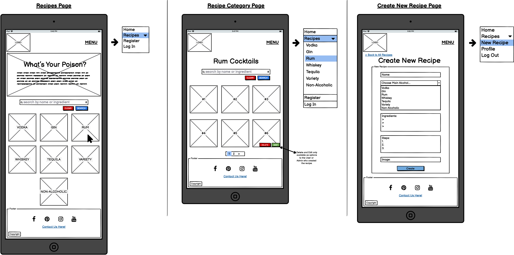

# 
**MS3: Pick Your Poison**

 ### View the live project [here.]()

This website has been created as my submission for Milestone Project 3 for the Code Institute. *Pick Your Poison* is a collaborative cocktail recipe site designed to allow users to search for and discover new cocktails as well as sharing their own recipes. Users can create an account which allows them to upload and edit their own cocktails. Non-members can also search for and browse the cocktail recipes. The site is designed to be user-friendly and visually appealing while also being responsive across a range of devices.

---

## Contents
- [**User Experience (UX)**](#ux)
    - [Strategy](#strategy)
        - [Target Audience](#target-audience)
        - [User Stories](#user-stories)
        - [Site Owner Goals](#site-owner-goals)
    - [Scope](#scope)
    - [Structure](#structure)
    - [Skeleton](#skeleton)
    - [Surface](#surface)
 - [**Features**](#features)
 - [**Technologies Used**](#technologies-used)
    - [Languages](#languages)
    - [Technologies](#technologies)
 - [**Testing**](#testing)
 - [**Deployment**](#deployment)
 - [**Credits**](#credits)
    - [Content](#content)
    - [Code](#code)
    - [Acknowledgements](#acknowledgements)

---
## 
**UX**

### **Strategy**
#### Target Audience
The target audience for this site would be adults who have a keen interest in mixology, from beginners looking to learn how to make their first cocktail, to professionals on the search for new and exciting recipes.

#### User Stories
All Users
- As a user, I want to easily navigate through the site.
- As a user, I want the site to be responsive on whichever device and/or browser I'm viewing it on.
- As a user, I want to easily contact the site owners with any questions I might have or problems I may encounter.
- As a user, I want to search for and browse different cocktail recipes.

First-Time User/Non Member
- As a first-time user, I want to immediately understand the purpose of the site.
- As a first-time user, I want to easily create an account if I choose to do so. 

Registered Users
- As a registered user, I want to easily log in with my username and password.
- As a registered user, I want to easily create my own cocktail recipes.
- As a registered user, I want to easily edit or delete my own cocktail recipes.
- As a registered user, I want to easily view and edit my profile
- As a registered user, I want to easily log out from my account.
- As a registered user, I want visual confirmation of any task performed.

Admin User
- As the admin, I want to be the only user who can add or edit cocktail categories.

#### Site Owner Goals
- Create a site that is appealing and useful to encourage users to create an account and upload new cocktail recipes.
- Build up a large database of cocktail recipes via new users.

### **Scope**
For all Users: 
- The site must be fully responsive across different devices and browsers.
- The site must be visually appealing and consistent to ensure the user is comfortable.
- A *fixed navigation bar* must be included to allow users to easily navigate throughout the site.
- A clear way of contacting the site owners must be provided via a *contact form*.
- A clear and simple means of searching for and browsing cocktail recipes must be provided via a *search bar*.
- Cocktail recipes should be divided into categories to allow users to more easily find what they are looking for.

For First-Time Users/Non-Members: 
- Clear information about the purpose of the site must be provided.
- A clear and simple means of creating an account must be provided.

For Registered Users:
- Clear and simple means of:
    - logging into their account,
    - creating a new cocktail recipe, 
    - editing or deleting their recipes, 
    - viewing and editing their profile, 
    - and logging out of their account must be provided.
- Visual confirmation of tasks performed must be provided.

For Admin:
- A clear and simple means of adding and/or editing cocktail recipe categories.

### **Structure**
#### Page

### **Skeleton**
All wireframes were created using [Balsamiq](https://balsamiq.com/).

#### Mobile

#### Tablet

#### Desktop

All wireframes can be found below;
- [Mobile Wireframes](documentation/wireframes/mobile)
- [Tablet Wireframes](documentation/wireframes/tablet)
- [Desktop Wireframes](documentation/wireframes/dekstop)

### **Surface**
#### Design

#### Colour

#### Imagery

---
## 
**Features**

---
## 
**Technologies Used**

### **Languages**

### **Technologies**

---
## 
**Testing**

---
## 
**Deployment**

---
## 
**Credits**

### **Content**
### **Code**
### **Acknowledgements**