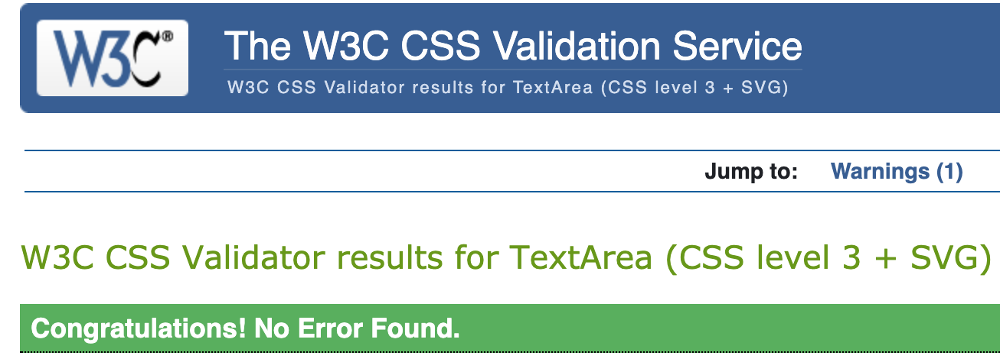
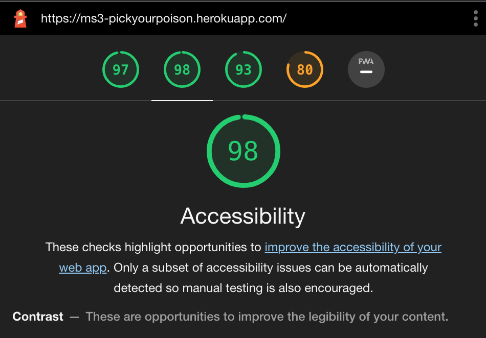

# 
**MS3: Pick Your Poison**

### View the live project [here.](https://ms3-pickyourpoison.herokuapp.com/)
### View the main README file [here.](README.md)

---
## Contents
- [**Testing**](#testing)
    - [Code Validation](#code-validation)
    - [Links Testing](#links-testing)
    - [Navigation Testing](#navigation-testing)
    - [Contact Form](#contact-form)
    - [Accessibility](#accessibility)
    - [Device Testing](#device-testing)
    - [Browser Testing](#browser-testing)
    - [Known Bugs](#known-bugs)
    - [Testing User Stories](#testing-user-stories)

---
## 
**Testing**

### **Code Validation**
- All HTML code was checked and validated with [ W3C Markup Checker](https://validator.w3.org/)
- All CSS code was checked and validated with [W3C CSS Validation Service](https://jigsaw.w3.org/css-validator/). No errors reported.

### **Links Testing**
- I manually tested every link contained within the site to ensure that they none were broken.
- The four social media links in the footer correctly open in new tabs.
- All internal links work and bring the user to the expected location within the site.
- Every link correctly changes colour when hovered over, making it clear that it is a link.

### **Navigation Testing**
- I manually tested the site's navigation bar to ensure navigation ease on both full and collapsed menus. 
    - This was done by using [Chrome DevTools](https://developers.google.com/web/tools/chrome-devtools) and by manually testing on physical devices.
- The navigation menu correctly collapses on smaller devices while still being clear that it is a means of navigation.

### **Contact Form**

### **Accessibility**
- I manually checked all images and icons on the site.
    - all images contain an alt attribute.
    - all social media icons contain a description for screen-reader users.
- I also tested the site's accessibility using [Lighthouse](https://developers.google.com/web/tools/lighthouse) in [Chrome DevTools](https://developers.google.com/web/tools/chrome-devtools)

- I noted that the contrast of some headings could be improved at a later date.

### **Device Testing**
- I manually tested the site on several different devices to ensure that it was responsive and that everything still functioned as expected.
- I also used [Chrome DevTools](https://developers.google.com/web/tools/chrome-devtools), as mentioned previously, in order to view the site on a range of different screen dimensions.
- I tested on my own devices and also reached out to some friends in order to get a wider range.
- The following devices were tested on:
    - **Android Mobile**
        - Huawei: P10, P30 Lite, P30
        - Samsung: Galaxy A40
        - No bugs or errors reported on these devices.
    - **Android Tablet**
        - Samsung: Galaxy Tab S7
        - No bugs or errors reported on this device.
    - **Apple Mobile**
        - iPhone: 6, 11 
        - 

### **Browser Testing**
- I manually tested the site on several different browsers to ensure that that everything still functioned as expected.
- The following browsers were used for manual testing on an Apple Macbook Pro:
    - **Google Chrome:** Site works well with no issues noted.
    - **Safari:** 
    - **Opera:** Site works well with no issues noted.
    - **Microsoft Edge:** Site works well with no issues noted.
- The following browsers were used for manual testing on various mobile devices:
    - **Google Chrome:** Site works well with no issues noted.
    - **Safari:** 

### **Testing User Stories**
All Users
- **"As a user, I want to easily navigate through the site."**

- **"As a user, I want the site to be responsive on whichever device and/or browser I'm viewing it on."**

- **"As a user, I want to easily contact the site owners with any questions I might have or problems I may encounter."**

- **"As a user, I want to search for and browse different cocktail recipes."**

First-Time User/Non Member
- **"As a first-time user, I want to immediately understand the purpose of the site."**

- **"As a first-time user, I want to easily create an account if I choose to do so. "**

Registered Users

- **"As a registered user, I want to easily log in with my username and password."**

- **"As a registered user, I want to easily create my own cocktail recipes."**

- **"As a registered user, I want to easily edit or delete my own cocktail recipes."**

- **"As a registered user, I want to easily view my profile"**

- **"As a registered user, I want to easily log out from my account."**

- **"As a registered user, I want visual confirmation of any task performed."**

Admin User
- **"As the admin, I want to be the only user who can add or edit cocktail categories."**
