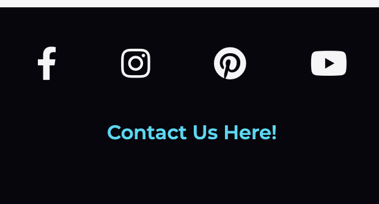
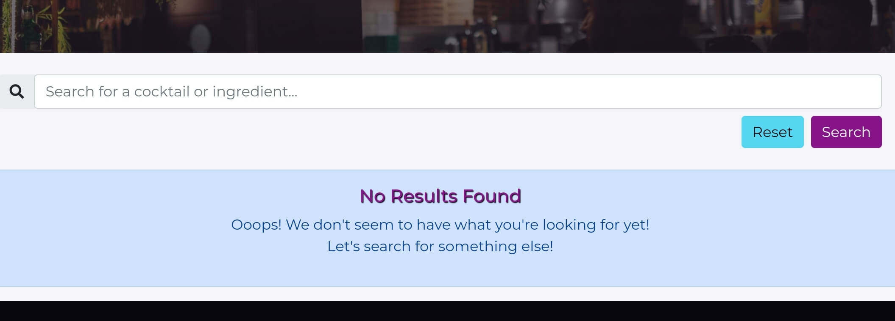
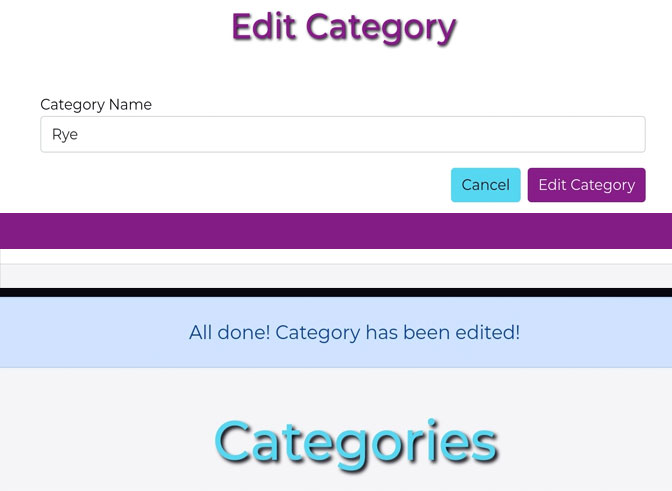

# 
**MS3: Pick Your Poison**

### View the live project [here.](https://ms3-pickyourpoison.herokuapp.com/)
### View the main README file [here.](README.md)

---
## Contents
- [**Testing**](#testing)
    - [Code Validation](#code-validation)
    - [Links Testing](#links-testing)
    - [Navigation Testing](#navigation-testing)
    - [Accessibility](#accessibility)
    - [Device Testing](#device-testing)
    - [Browser Testing](#browser-testing)
    - [Known Bugs](#known-bugs)
    - [Contact Form](#contact-form)
    - [CRUD](#crud)
    - [Testing User Stories](#testing-user-stories)

---
## 
**Testing**

### **Code Validation**
- All HTML code was checked and validated with [ W3C Markup Checker](https://validator.w3.org/). 
    - On first check, I was alerted to a div that was missing a closing tag. 
    - I fixed this and ran it through again. No further errors reported.

- All CSS code was checked and validated with [W3C CSS Validation Service](https://jigsaw.w3.org/css-validator/). No errors reported.

- JavaScript code was passed through [JSHint](https://jshint.com/) with no major errors.
- Python code was passed through [PEP8 online](http://pep8online.com/) to ensure compliancy. 
    - On first check, I was alerted to an error **E125** for "continuation line with same indent as next logical line".
    - I fixed this in my app.py and checked the code again. No errors reported.

### **Links Testing**
- I manually tested every link contained within the site to ensure that they none were broken.
- The four social media links in the footer correctly open in new tabs.
- All internal links work and bring the user to the expected location within the site.
- Every link correctly changes colour when hovered over, making it clear that it is a link.

### **Navigation Testing**
- I manually tested the site's navigation bar to ensure navigation ease on both full and collapsed menus. 
    - This was done by using [Chrome DevTools](https://developers.google.com/web/tools/chrome-devtools) and by manually testing on physical devices.
- The navigation menu correctly collapses on smaller devices while still being clear that it is a means of navigation.

### **Accessibility**
- I manually checked all images and icons on the site.
    - all images contain an alt attribute.
    - all icons contain a description for screen-reader users.
- I also tested the site's accessibility using [Lighthouse](https://developers.google.com/web/tools/lighthouse) in [Chrome DevTools](https://developers.google.com/web/tools/chrome-devtools)

- I noted that the contrast of some headings could be improved at a later date.

### **Device Testing**
I manually tested the site on several different devices to ensure that it was responsive and that everything still functioned as expected.
- I also used [Chrome DevTools](https://developers.google.com/web/tools/chrome-devtools), as mentioned previously, in order to view the site on a range of different screen dimensions.
- I tested on my own devices and also reached out to some friends in order to get a wider range.
- The following devices were tested on:
    - **Android Mobile**
        - Huawei: P10, P30 Lite, P30
        - Samsung: Galaxy A40
        - No bugs or errors reported on these devices.
    - **Android Tablet**
        - Samsung: Galaxy Tab S7
        - No bugs or errors reported on this device.
    - **Apple Mobile**
        - iPhone: 6, 11 

### **Browser Testing**
I manually tested the site on several different browsers to ensure that everything still functioned as expected.
- The following browsers were used for manual testing on an Apple Macbook Pro:
    - **Google Chrome:** Site works well with no issues noted.
    - **Safari:** 
    - **Opera:** Site works well with no issues noted.
    - **Microsoft Edge:** Site works well with no issues noted.
- The following browsers were used for manual testing on various mobile devices:
    - **Google Chrome:** Site works well with no issues noted.
    - **Safari:** 

### **Contact Form**
I performed manual testing on the *Contact Form* on the site to ensure that it functioned as it should.
- The following steps were followed for this testing procedure;
    - Navigate to the *Contact* page via the "Contact Us Here!" link contained in the footer on every page of the site.
     

    - Attempt to submit the form, leaving one field empty each time.
    - Make note of the error alert that appears (as seen in the image below).
    - Attempt to submit the form with an incorrect *Email Address* format.
    - Make note of the error alert that appears (as seen in the image below).
    

    - Fill in all form fields correctly (with own email address) and submit.
    - Make note of the alert that appears upon submitting the form successfully (as seen in the image below).
    

    - Check the site owner's inbox to ensure that the contact form details were received correctly (as seen in the image below).
    - Check the email inbox of the email address provided in the form to ensure the automated response was received (as seen in the image below).
    

- From this testing I concluded that the *Contact Form* is functional and performs its tasks correctly.

### **CRUD**
For my testing I wanted to ensure that all registered users were able to Create, Read, Update and Delete cocktail recipes.
- I manually tested this by logging in, navigating to the *New Recipe* page and creating a new cocktail recipe.
- I navigated down my *Profile* page and found my new cocktail, "Hawaiian Iced Tea".
- I clicked the *View Recipe* button and viewed the recipe to ensure all the details I had entered were present.

- I then clicked the *Edit* icon button of the recipe and edited the details for every field in the *Edit Recipe Form*, changing "Hawaiian Iced Tea" into "Bay Breeze".

- I returned to my profile to ensure that the recipe had been updated. "Hawaiian Iced Tea" was correctly updated to "Bay Breeze".
- I then clicked the *Delete* icon button of the recipe and the modal popped up.
- I confirmed the deletion by clicking the *Delete* button in the modal and returned to my profile to ensure the cocktail was gone. 
- Cocktail had been deleted successfully.

I also wanted to ensure that the admin was able to Create, Read, Update and Delete categories.
- I manually tested this by logging in as admin, creating a new category, viewing this category, editing this category and finally deleting this category. 

From the testing above I am satisfied that the site is functional in this regard. Further testing of the above are discussed below in User Stories.

### **Testing User Stories**
**All Users**

- **"As a user, I want to easily navigate through the site."**
    - Regardless of what page the user is on, they can always find the navigation bar at the top of each page.
    - The user can always click on the logo image at the top of every page to return them to the *Home* page.
    - The user can always see clear names of each page so they know where to navigate to for the information or content they're looking for.
        - For All Users: *Home, Recipes, Register, Login*.
        - For Registered Users: *Home, Recipes, New Recipe, Profile, Log Out*.
        - For Admin: *Home, Recipes, New Recipe, Profile, Categories, Log Out*.
    

    - The user can easily identify links, as a means of navigation, as they change colour and/or change size when hovered over.
    - All of the above points are true across all devices; mobile, tablet, desktop etc.

- **"As a user, I want the site to be responsive on whichever device I'm viewing it on."**
    - The user will find the site responsive across devices as seen in the image below.
    - All content can be clearly seen aross devices.
    - The user will find the site visually consistent throughout.

    

- **"As a user, I want to easily contact the site owners with any questions I might have or problems I may encounter."**
    - The user can click on a link located in the footer (on every page of the site) to go directly to the *Contact* page.
        - This link is in the form of "*Contact Us Here!*", which lets the user know where they can expect to be brought to.
        - This link changes size and colour when hovered over to further reinforce to the user that it is a clickable link.
        

    - On the *Contact* page the user will immediately find a contact form to fill out;
        - This form allows the user to enter their name, an email address for the site owner to respond to, and their message/question.
        - The user will be alerted if they try to submit the form with any blank fields or if a field is filled incorrectly.
        - The user will be alerted if the form has been submitted successfully.
        - The user will receive an email, to the email address that they entered in the form, confirming the site owner has received their message.
        - Full details of the testing involved for this contact form can be found [here](#contact-form).
    - The above points are true across all devices; mobile, tablet, desktop.

- **"As a user, I want to search for and browse different cocktail recipes."**
    - The user can click on *"Recipes"* in the navigation bar to go directly to the *Recipes* Page.
    - The user can click on a link located near the bottom of the *Home* page to go directly to the *Recipes* page.
        - This link is in the form of "*Click **Here** To View All Cocktail Recipes*", which lets the user know where they can expect to be brought to.
        - This link changes size and colour when hovered over to further reinforce to the user that it is a clickable link.
        

    - On the *Recipes* page the user will find all cocktail recipes that have been added to the site. 
        - The user can scroll down this page browsing recipes, seeing each recipe in its own panel.
        

        - On each panel the user will see each cocktail's name, image, cocktail type and a *View Recipe* button.
            - If the user is the creator of that recipe they will also see icon buttons for *Edit* and *Delete* below the cocktail name in the panel.
            

        - The *View Recipe* button changes colour when hovered over to reinforce to the user that it is clickable.
        

        - When clicked, the user is brought to the page for that particular recipe where they'll find further information about the recipe including *Ingredients* and *Steps*.
            - If the user is the creator of this recipe, they will also see icon buttons for *Edit* and *Delete* below the cocktail name.

         

        - The user can return to the previous *Recipes* page via a link on the top left of the page *"Back to All Recipes"*.
    - On the *Home* and *Recipes* pages, the user can find a *search bar*.
        - Within the search bar the user can see a label stating "Search for a cocktail or ingredient...".
        

        - The user can enter whatever they are looking for, "Non-Alcoholic" for example, and then press enter or click the *Search* button
        - If there are cocktails matching their search, the user will be brought to the *Recipes* page with the cocktail recipes filtered according to their search.
        

        - The user can click the *Reset* button under the *search bar* to reset the search and return all recipes.
        - If there are no cocktails matching their search, the user will be alerted to this and encouraged to search for something else.
        

**First-Time User/Non Member**

- **"As a first-time user, I want to immediately understand the purpose of the site."**
    - Upon landing on the site the user can immediately find an introduction the the site below the hero image.
    - The hero image itself helps to set the tone of the site and contains the word *"Cocktail"* which further emphasises the site purpose.
    - When the user scrolls down they will find *"Browse through our recipes, create an account and share your own cocktails with us!".* 
    - The navigation bar also has a link titled *Recipes* which is visible to all user on both full and collapsed menus.
    - All of the above helps to immediately inform the user about the site's purpose immediately upon arriving.

- **"As a first-time user, I want to easily create an account if I choose to do so. "**
    - The user can click on *"Register"* in the navigation bar to go directly to the *Register* Page.
        - This is true on both full and collapsed menus.
    - The user can click on a link located near the bottom of the *Home* page to go directly to the *Register* page.
        - This link is within a message stating "**Create an Account** *to Add and Edit Your Own Recipes*!", which lets the user know where they can expect to be brought to.
        - This link changes size and colour when hovered over to further reinforce to the user that it is a clickable link.
    - The user can click on a link located near the bottom of the *Log In* page to go directly to the *Register* page.
        - This link is within a message stating "*Don't Have an Account?* **Register Here!**", which lets the user know where they can expect to be brought to.
        - This link changes size and colour when hovered over to further reinforce to the user that it is a clickable link.

    

    - On the *Register* page the user will find a Registration form to be filled out;
        - This form allows the user to choose a *Username* and *Password*.
        - Descriptions under each form field tell the user what characters are accepted to keep things clear and simple.
        

        - The user will be alerted if they try to submit the form but their chosen username has already been taken by another user.
        

        - The user will be alerted if they try to submit the form with either field empty or filled out incorrectly.
        

        - Upon successful registration, the newly registered user will be brought directly to their new profile.
        - The newly registered user will be alerted to their successful registration.
        

**Registered Users**

- **"As a registered user, I want to easily log in with my username and password."**
    - The user can click on *"Log In"* in the navigation bar to go directly to the *Log In* Page.
        - This is true on both full and collapsed menus.
    - The user can click on a link located near the bottom of the *Register* page to go directly to the *Log In* page.
        - This link is within a message stating "*Already Registered?* **Log In Here!**", which lets the user know where they can expect to be brought to.
        - This link changes size and colour when hovered over to further reinforce to the user that it is a clickable link.
    

    - On the *Log In* page the user will find a form to be filled out;
        - This form allows the user to enter their *Username* and *Password*.
        - The user will be alerted if they try to submit the form with an empty field.
        - The user will be alerted if the *Username* and/or *Password* are entered incorrectly.
        

        - Upon successful login, the user will be brought directly to their profile.
        - The user will be alerted to their successful login.
        

- **"As a registered user, I want to easily create my own cocktail recipes."**
    - The user can click on *New Recipe* in the navigation bar to go directly to the *New Cocktail Recipe* Page.
        - This is true on both full and collapsed menus.
    - On the *New Cocktail Recipe* page the user will find a form to be filled out with fields for;
        - Cocktail Name
        - Choose Main Alcohol (dropdown select meny)
        - Ingredients
        - Steps
        - Cocktail Image URL
        - Cocktail Image Credit
    - The user will be alerted if they try to submit the form with any field empty.
    

    - The fields for *Ingredients, Steps* and *Cocktail Image Credit* have labels underneath so that the user understands what exactly is required.
    - Upon successful creation of the recipe the user will be brought to the *Recipes* page.
    - The user will be alerted to the successful recipe creation. 
    

    - The user can click the *Cancel* button if they do not wish to add the recipe and this will bring them back to the *Recipes* page.

    - The user can find their new recipe on the *Recipes* page and on their *Profile* page.
    

- **"As a registered user, I want to easily edit or delete my own cocktail recipes."**
   - The user can click on the *Edit* icon button of any of their own recipes to go directly to the *Edit Cocktail Recipe* Page.
        - This button is accessible beneath the Cocktail Name on the recipe card panels found on the *Recipes* page, the user's *Profile* page and on each cocktails own recipe page.
    - On the *Edit Cocktail Recipe* page the user will find a form that is pre-filled with the recipe's current values.
    

    - The user will be alerted if they try to submit the form with any field empty.
        - Upon a successful edit of the recipe the user will be brought to the *Recipes* page.
        - The user will be alerted to the successful recipe edit. 
        

        - The user can click the *Cancel* button if they do not wish to edit the recipe and this will bring them back to the *Recipes* page.
    - The user can click on the *Delete* icon button of any of their own recipes to activate a *delete modal*.
        - This button is accessible beneath the Cocktail Name on the recipe card panels found on the *Recipes* page, the user's *Profile* page and on each cocktails own recipe page.
        - The *modal* acts as a defence to prevent the user from accidentally deleting their recipes.
        - The *modal* will ask the user if they are sure they wish to delete their recipe.
        

        - The user can click the *Cancel* button which will close the modal and **not** delete the recipe.
        - The user can click the *Delete* button which will successfully delete the recipe.
        - The user will be alerted to a successful deletion and will be brought to the *Recipes* page.
        

- **"As a registered user, I want to easily view my profile"**
    - The user can click on *Profile* in the navigation bar to go directly to their profile.
        - This is true on both full and collapsed menus.
    - The user will see all cocktails that they have created, seeing each recipe in its own panel.
    

    - The user will see icon buttons for *Edit* and *Delete* below the cocktail name in the panel.

- **"As a registered user, I want to easily log out from my account."**
    - The user can click on *Log Out* in the navigation bar to activate a *logout modal*.
        - This is true on both full and collapsed menus.
        - The modal acts as a defence to prevent the user from accidentally logging out.
    - The *modal* will ask the user if they are sure they wish to log out.
    

    - The user can click the *Cancel* button which will close the modal and keep the user logged in.
    - The user can click the *Logout* button which will successfully log the user out of their account.
    - The user will be alerted to a successful logout and will be brought to the *Log In* page.
    

- **"As a registered user, I want visual confirmation of any task performed."**
    - The user is given visual confirmation of any tasks they perform via message alerts which appear beneath the navigation bar at the top of the page.
    

    - This includes confirmation of the following;
        - Successful Log In
        - New Recipe Created
        - Recipe Edited
        - Recipe Deleted
        - Successful Logout
        - Contact Form Sent 

**Admin User**

- **"As the admin, I want to be the only user who can add or edit cocktail categories."**
    - The admin can click on *Categories* in the navigation bar to go directly to the *Categories* page.
        - This link is only available and accessible to the admin.
    

    - The admin will find an *Add Category* button which changes colour when hovered over to emphasise to the admin that it is a clickable link.
        - When clicked, the admin will be brought to the *Add Category* page.
        - On this page, the admin will find a small form with just one field for *Category Name* and two buttons, *Cancel* and *Add Category*.
        - The admin will be alerted if they try to submit the form with the field empty.
        - Upon successful submission of the form, the admin will be returned to the *Categories* page.
        - The admin will be alerted to the successful addition.
        

        - The admin can click the *Cancel* button if they do not wish to add the category and this will bring them back to the *Categories* page.
    - On the *Categories* page the admin will find all categories that have been added to the site. 
        - Each category is within its own panel with icon buttons for *Edit* and *Delete* beside each category name.
    - The admin can click on the *Edit* icon button to go directly to the *Edit Category* Page.
        - On the *Edit Category* page the admin will find a form that is pre-filled with the category's current value.
        - The admin will be alerted if they try to submit the form with any field empty.
        - Upon a successful edit of the category the admin will be brought to the *Categories* page.
        - The admin will be alerted to the successful category edit. 
        

        - The admin can click the *Cancel* button if they do not wish to edit the category and this will bring them back to the *Categories* page.
    - The user can click on the *Delete* icon button of any of the categories to activate a *delete modal*.
        - The *modal* acts as a defence to prevent the admin from accidentally deleting the category.
        - The *modal* will ask the admin if they are sure they wish to delete the category.
        - The admin can click the *Cancel* button which will close the modal and **not** delete the category.
        - The admin can click the *Delete* button which will successfully delete the category.
        

        - The admin will be alerted to a successful deletion and will be brought to the *Categories* page.

